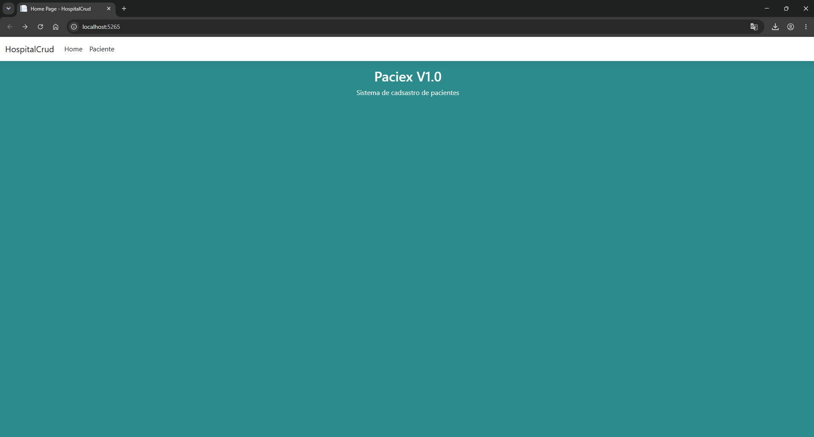

<div align="center">

# 🏥 HospitalCrud

### Sistema de Gerenciamento de Hospitais e Pacientes

Aplicação desenvolvida em **ASP.NET Core MVC** utilizando **C#**, **Entity Framework Core (Code First)** e **SQL Server**.


</div>

---

# 📑 Índice

- [📖 Sobre o Projeto](#-sobre-o-projeto)
- [🚀 Funcionalidades](#-funcionalidades)
- [🛠 Tecnologias Utilizadas](#-tecnologias-utilizadas)
- [📦 Pacotes Utilizados](#-pacotes-utilizados)
- [🗄 Banco de Dados](#-banco-de-dados)
- [📷 Telas do Sistema](#-telas-do-sistema)
- [▶️ Como Executar](#️-como-executar)
- [📁 Estrutura do Projeto](#-estrutura-do-projeto)
- [👨‍💻 Créditos](#-créditos)

---

# 📖 Sobre o Projeto

O **HospitalCrud** é um sistema desenvolvido para fins acadêmicos com o objetivo de aplicar os conceitos do padrão arquitetural **Model-View-Controller (MVC)** utilizando o ecossistema **ASP.NET Core**.

A aplicação permite realizar operações de **CRUD (Create, Read, Update e Delete)** para gerenciamento de informações relacionadas a **Hospitais** e **Pacientes**, utilizando persistência de dados através do **Entity Framework Core** com abordagem **Code First** e banco de dados **SQL Server**.

Além disso, o projeto emprega recursos modernos de interface, oferecendo uma navegação intuitiva e responsiva.

---

# 🚀 Funcionalidades

✅ Cadastro de Hospitais

✅ Cadastro de Pacientes

✅ Edição de registros

✅ Exclusão de registros

✅ Consulta de informações

✅ Interface Responsiva

✅ Pesquisa dinâmica

✅ Ordenação de colunas

✅ Paginação utilizando DataTables

---

# 🛠 Tecnologias Utilizadas

| Tecnologia | Descrição |
|------------|-----------|
| C# | Linguagem principal |
| ASP.NET Core MVC | Arquitetura da aplicação |
| Entity Framework Core | ORM |
| SQL Server | Banco de Dados |
| Bootstrap | Interface Responsiva |
| jQuery | Manipulação da interface |
| DataTables | Pesquisa, paginação e ordenação |

---

# 📦 Pacotes Utilizados

O projeto utiliza os seguintes pacotes:

- Microsoft.EntityFrameworkCore
- Microsoft.EntityFrameworkCore.Tools
- Microsoft.EntityFrameworkCore.Design
- Microsoft.VisualStudio.Web.CodeGeneration.Design

---

# 🗄 Banco de Dados

A persistência dos dados foi implementada utilizando o **SQL Server**.

O banco foi criado seguindo a abordagem **Code First**, utilizando o recurso de **Migrations** do Entity Framework Core.

Para criação da base de dados basta executar:

```powershell
Update-Database
```

---

# 📷 Telas do Sistema

## 🏠 Tela Inicial

<div align="center">



</div>

---

## 👨‍⚕️ Listagem de Instrutores

<div align="center">


</div>

---

# ▶️ Como Executar

## Clone o projeto

```bash
git clone https://github.com/nelmo-cmyk/HospitalCrud.git
```

---

## Abra a solução

Abra o projeto utilizando o **Visual Studio 2022**.

---

## Configure a conexão

Edite o arquivo:

```text
appsettings.json
```

Configurando a sua string de conexão com o SQL Server.

---

## Execute as Migrations

```powershell
Update-Database
```

---

## Execute o projeto

Pressione **F5** ou clique em **Iniciar** no Visual Studio.

---

# 📁 Estrutura do Projeto

```text
HospitalCrud
│
├── Controllers
├── DataContext
├── Migrations
├── Models
├── Views
├── wwwroot
├── imagens
├── appsettings.json
├── Program.cs
└── README.md
```

---

# 🎯 Objetivos de Aprendizagem

Este projeto foi desenvolvido com o propósito de praticar:

- ASP.NET Core MVC
- Arquitetura MVC
- Entity Framework Core
- Migrations
- Code First
- SQL Server
- Bootstrap
- CRUD
- Paginação com DataTables
- Boas práticas de organização de projetos

---

# 👨‍💻 Créditos

### Desenvolvedor

**Seu Nome Aqui**

Nelmo Marim 

### Professor

**Wallace Oliveira dos Santos**

---

<div align="center">

### ⭐ Se este projeto foi útil para você, deixe uma estrela no repositório!

</div>
